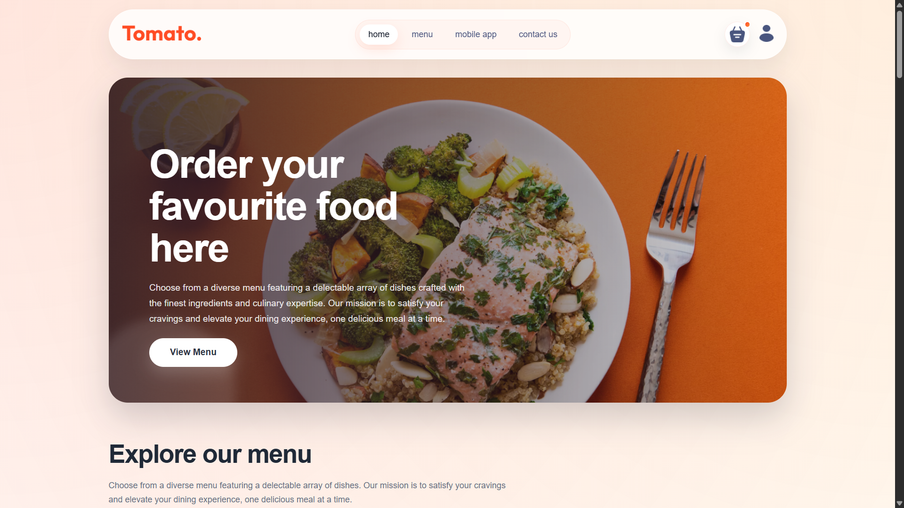
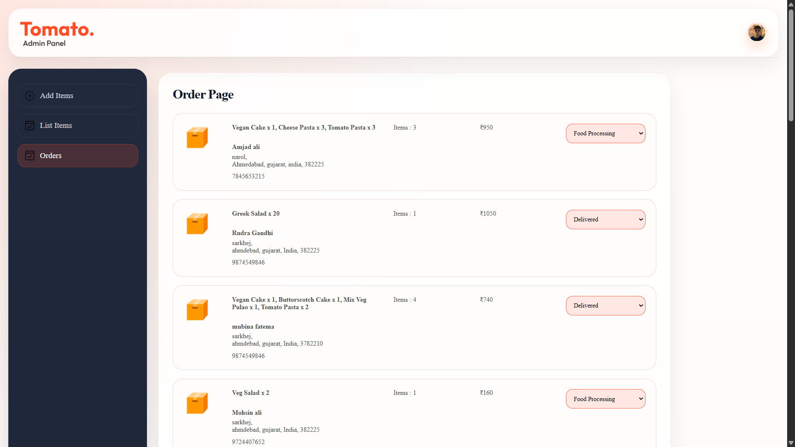
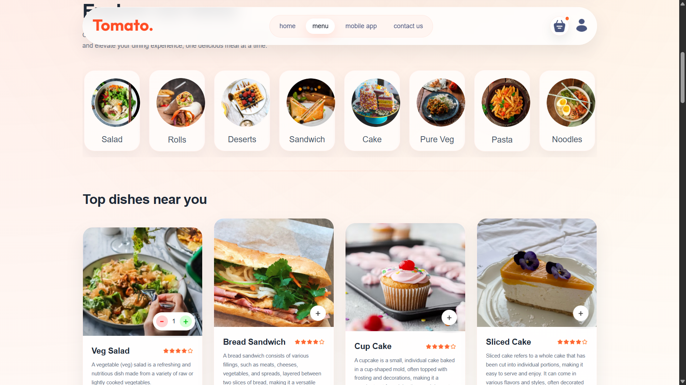
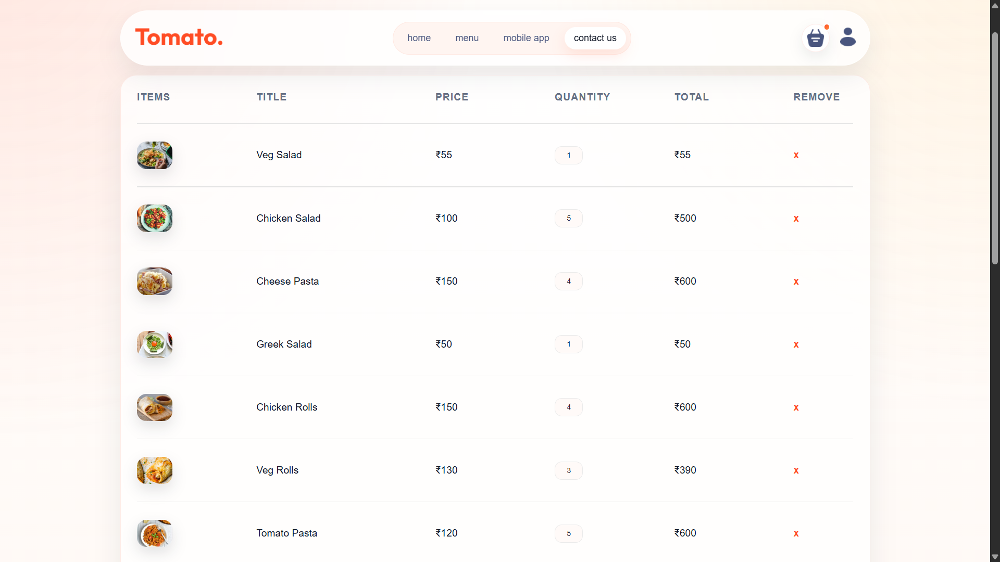
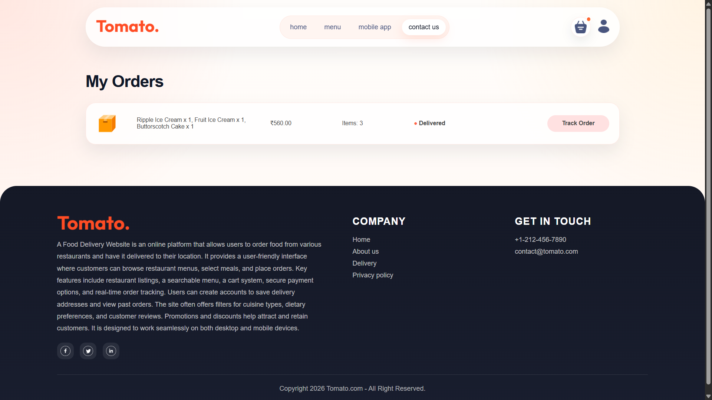

# 🍔 Food Delivery App (MERN Stack)

## 📌 Description

This is a full-stack Food Delivery web application built using the MERN stack.
It includes a user-facing frontend, an admin panel, and a backend API for managing food items, orders, and users.

---

## 🚀 Features

### 👤 User (Frontend)

* Browse food items
* Add to cart
* Place orders
* User-friendly UI

### 🛠️ Admin Panel

* Add / Edit / Delete food items
* Manage orders
* Manage products

### 🔧 Backend

* RESTful APIs
* CRUD operations
* Database integration with MongoDB

---

## 🛠️ Tech Stack

* **Frontend:** React (Vite)
* **Admin Panel:** React
* **Backend:** Node.js, Express
* **Database:** MongoDB

---

## 📁 Project Structure

frontend → User interface
backend → API & server logic
admin → Admin dashboard

---

## ⚙️ Installation & Setup

### 1️⃣ Clone Repository

git clone https://github.com/mohsin7786/Food-Delivery.git

---

### 2️⃣ Install Dependencies

#### Backend

cd backend
npm install

#### Frontend

cd frontend
npm install

#### Admin

cd admin
npm install

---

### 3️⃣ Run the Project

#### Backend

npm run server

#### Frontend

npm run dev

#### Admin

npm run dev

---

## 🔗 API Endpoints (Example)

* GET /api/foods → Get all food items
* POST /api/foods → Add new item
* PUT /api/foods/:id → Update item
* DELETE /api/foods/:id → Delete item

---

## 📷 Screenshots

## 📷 Screenshots

### 🏠 Home Page

### 🛠️ Admin Panel

### 📋 Menu Page

### 🛒 Cart Page

### 📦 Orders Page

---

## 👨‍💻 Author

Mohsin

---
